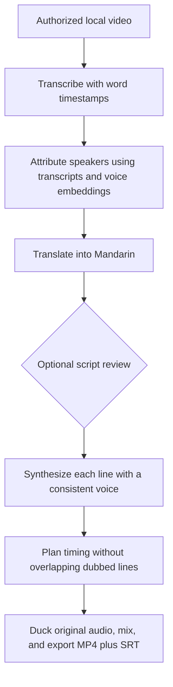

# Peiyin 配音

**A local Mandarin-dubbing tool for private language learning.** Peiyin combines
speech recognition, speaker attribution, translation and timed speech synthesis
in a browser interface running on your computer.

**Beta: 1.0.0b1.** English input and Mandarin output. The repository contains
source code and invented configuration/test examples. No video, transcripts,
voice recordings, model weights or public media demo are distributed.

Read the [user guide](docs/USER-GUIDE.md), [personal-use disclaimer](DISCLAIMER.md),
[security notes](SECURITY.md) and [release checklist](docs/RELEASE-CHECKLIST.md).

## What runs where

Transcription, speaker embeddings, timing and video mixing run locally. OpenAI
or Gemini receives dialogue and speaker context for casting and translation.
Fish Audio receives translated text, delivery cues and voice selections for
speech synthesis. Your own provider accounts and API keys are required; usage,
key tests and voice previews can incur charges.

The interface binds to localhost, with public sharing and Gradio analytics
disabled. It is designed for one person on their own machine. It is not an
internet-hosted service. Speech models download on first use; configured remote
transcript sources can also be fetched.

## How it works



- **Speaker attribution:** transcript alignment, neighbouring-line inference and
  acoustic speaker embeddings. Transcript-free mode is less accurate.
- **Consistent casting:** character voices are saved per profile; guests use
  separate pools. Automatic public-library guest selection is off by default.
- **Timing:** lines start no earlier than their onset, use available gaps and
  speed up when necessary. Dubbed lines do not overlap each other.
- **Review:** optionally edit speaker assignments and Mandarin text before
  synthesis, or run a clip/queue automatically.
- **Cache reuse:** file contents, profile/transcript contents, transcription model,
  language-model selection, voice and synthesis model determine reusable stages.
- **Private outputs:** videos and subtitles stay on your computer. MP4 metadata
  identifies the audio as AI-generated; this is not a compliance certification.

## Install and start

Use **Python 3.10–3.12**; **3.12 is recommended**. Download this repository using
**Code → Download ZIP**, extract it, and open a terminal in that folder.

macOS / Linux:

```bash
python3.12 -m venv venv
./venv/bin/python -m pip install --upgrade pip
./venv/bin/python -m pip install -r requirements.txt
./venv/bin/python -m peiyin
```

Windows PowerShell:

```powershell
py -3.12 -m venv venv
.\venv\Scripts\python.exe -m pip install --upgrade pip
.\venv\Scripts\python.exe -m pip install -r requirements.txt
.\venv\Scripts\python.exe -m peiyin
```

Alternatively, use the launcher in `scripts/` for your OS. It selects a supported
Python version and installs the requirements. Keep the terminal running; Ctrl+C
stops the app. Add `--no-browser` to start without opening a browser.

FFmpeg is supplied by `imageio-ffmpeg`. Internet access is needed for setup,
model downloads and the configured APIs. A CJK font is needed for burned-in
Mandarin subtitles; soft subtitles are used if burning is unavailable.

## First use

1. **Settings:** enter your Fish key and an OpenAI or Gemini key, test them, then
   save. Alternatively use the environment variables in `.env.example`.
2. **Dub:** create/select a profile describing your characters and optionally
   your authorized transcript folder. Restart or reselect after editing TOML.
3. **Cast:** assign authorized voices, preview them and save the cast. Add guest
   voices if needed.
4. Add a short video. Use **Dub it** for automatic processing, or **Review script →
   Prepare script**, edit, then **Render reviewed script**.
5. Inspect the finished output privately. The default export folder is
   `~/Peiyin Output`. No upload or public demo is needed.

The selected language model is used for both casting and translation. Blank
uses `gpt-4o-mini` for OpenAI or `gemini-2.5-flash` for Gemini. Peiyin does not
probe your account for a more expensive model. Check provider availability and
pricing before choosing another model.

## Profiles and caches

The packaged [template](peiyin/data/profiles/TEMPLATE.toml) and
[invented example](peiyin/data/profiles/example_show.toml) contain no transcript
source or voice IDs. User profiles live in `~/.peiyin/profiles/`.

Use `target_language = "zh-CN"`; other output languages are rejected. Local
transcripts use one file per episode and can be `name_colon`, `srt_with_speakers`
or `html`. At least five speaker-labelled lines are needed for a readable
transcript. A local file edit invalidates the relevant cache. For remote
transcripts, change `[transcripts].revision` after the source content changes.

Work is stored under `~/.peiyin/work_v17/`. Older caches are left untouched and
are not reused by this beta. Re-runs after relevant changes may incur new API
charges. Export filenames include a short content identifier to distinguish
same-named inputs; a re-render of the same input replaces its previous exports.

## Personal use and privacy

Peiyin is intended for private, personal language learning with material you have
permission or another lawful basis to process. Owning a copy or paying for a
subscription does not automatically grant rights to translate, upload or share
it. Educational and noncommercial use are not blanket exemptions.

Only use authorized voices. Public-library availability does not prove consent.
Do not impersonate people or distribute outputs without the necessary rights and
disclosures. See [the full disclaimer](DISCLAIMER.md).

Keys explicitly saved in Settings are plaintext in `~/.peiyin/config.json`, with
private creation/replacement permissions on macOS/Linux. Windows relies on your
account's folder permissions. Saved keys are never prefilled in the browser;
blank fields retain them. Environment variables take precedence and are not
persisted by a dub. Protect your account, backups and working files.

## Limitations

- Mandarin output only; speaker identity, timing and translation can be wrong.
- Transcripts materially improve attribution; overlapping speech remains hard.
- The mixer ducks the original track; it does not isolate/remove original speech.
- Failed lines may survive only as subtitles. Review the output before relying on it.
- No performance or accuracy benchmark is claimed. Paid end-to-end compatibility
  must be checked privately with your own provider accounts.
- Local automated verification is on macOS/Python 3.12. CI is configured for
  Windows, Linux and macOS across Python 3.10–3.12; inspect its actual results.

## Development

```bash
python -m pip install -e '.[dev]'
pytest -q
ruff check peiyin tests scripts
python -m pip_audit
python scripts/smoke_ui.py
python -m build
python scripts/check_wheel.py
```

Tests use invented text and generated tones, block network connections and use
temporary app storage. The separate HTTP smoke check opens a temporary local
server to verify upload/download behaviour and denial of private files, without
calling paid APIs. See [the implementation review](docs/PUBLISHING-REVIEW.md)
for verification scope and remaining manual checks.

## License and attribution

[MIT](LICENSE) for Peiyin's source. The personal-use intention does not add a
noncommercial restriction to that license. Third-party software, models, content
and services have separate terms: [notices](NOTICE.md) and
[speaker-model attribution](docs/MODEL-PROVENANCE.md).

Built with faster-whisper, Silero VAD, sherpa-onnx, Gradio and FFmpeg, with Fish
Audio speech synthesis and OpenAI/Gemini translation. Developed with
Claude-assisted coding. Peiyin does not claim authorship of the underlying models.
